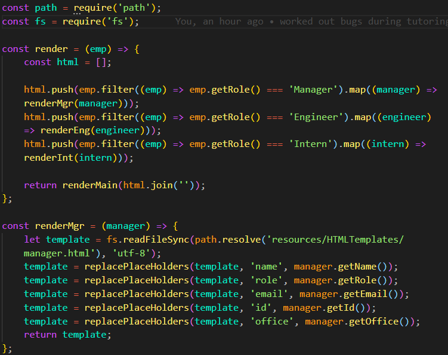

# Team Profile Generator

## Description
Team Profile Generator is a command-line application using Node.js that takes in information about employees on a software engineering team and generates an HTML webpage that displays summaries for each person.

## Table of Contents
[Technologies](#technologies)
[Prerequisites](#prerequisites)
[Installation](#installation)
[Usage](#usage)
[Licensing](#licensing)
[Project Status](#projectStatus)
[Contributing](#contributing)
[Test](#test)
[Acknowledgements](#acknowledgements)
[Questions](#questions)

## Technologies
* You are using a Linux, Mac or Windows machine.,* You have a basic understanding of javascript.

## Prerequisites
CSS, HTML, JavaScript, Node.js

## Installation
To install this application: branch the Github Repo and clone the repo to your
local machine. If not already installed, you must install the node dependencies by running
npm install command in your terminal. Once completed,
you are ready to use the application!

## Usage
After installing the project, run the command node app.js in the command line
and enter the employee information following the prompts.

## Licensing
[Creative Commons] CC0 1.0 Universal CREATIVE COMMONS CORPORATION IS NOT A LAW FIRM AND DOES NOT PROVIDE LEGAL SERVICES.DISTRIBUTION OF THIS DOCUMENT DOES NOT CREATE AN ATTORNEY - CLIENT RELATIONSHIP.CREATIVE COMMONS PROVIDES THIS INFORMATION ON AN 'AS-IS' BASIS.CREATIVE COMMONS MAKES NO WARRANTIES REGARDING THE USE OF THIS DOCUMENT OR THE INFORMATION OR WORKS PROVIDED HEREUNDER, AND DISCLAIMS LIABILITY FOR DAMAGES RESULTING FROM THE USE OF THIS DOCUMENT OR THE INFORMATION OR WORKS PROVIDED HEREUNDER.

## Project Status
Complete

## Contributing
Contribute to README Generator
To contribute to README Generator, follow these steps:
    1. Fork this repository.
    2. Create a branch: git checkout -b <branch name>.
    3. Make your changes and commit them: git commit -m '<commit message>'.
    4. Push to the original branch: git push origin <project_name/<location>
    5. Create the pull request.
                Alternatively, see the Github documentation on creating a pull request.

## Tests

## Acknowledgements
Sources:
*https://github.com/TheBrellis Template-Engine-Employee-Summary/blob/master,
*https://github.com/JeffQuit/OOP---Team-Profile-Generator

## Questions
My name is Nikki Mounce
Reach me with additional questions: nikkimounce@gmail.com
Check out my GitHub: github.com/Nmounce

